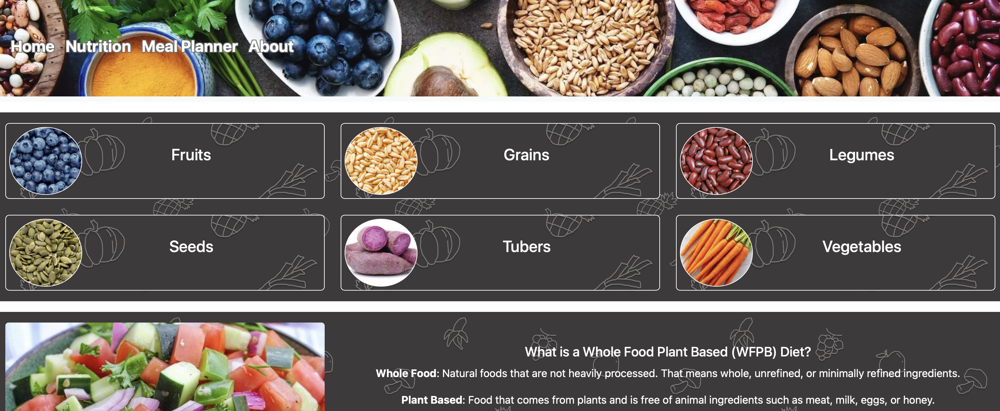

# WFPB-Website
## Whole Food Plant Based Website with Macro / Micro Nutrient Calculator

This project contains data and resources for the WFPB lifestyle. The user will be able to search foods based on macro / micro nutrients. 

Technologies Used: Python, Django, HTML, CSS

Screenshot of ... Page:
